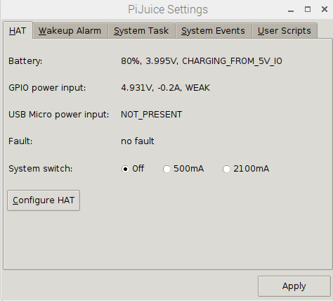
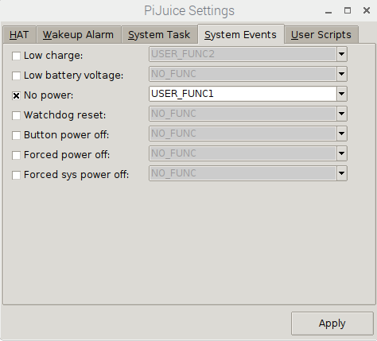
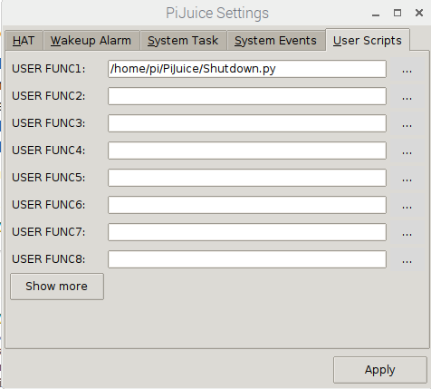

# PiJuice

To get PiJuice installed, run this command in Termit:

sudo apt-get install pijuice-gui

Next, open up PiJuice Settings. It can be found in the Start Menu under prefrences. It should open a window like 

Go to the System Events tab and click the "No Power" event box and use the dropdown menu to select 'USER_FUNC1' like 

Finally, head over to the 'User Scripts' section and use the '...' button to select the path to Shutdown.py for 'USER_FUNC1'. THe screen should look like .

When the battery is unplugged from a power source, the LEDs on pin D2 should blink red and blue, signifying the beginning of the shutdown process. The Raspberry Pi will then turn off, and 20 seconds later, the battery will turn off as well. These numbers are adjustable in the code(See Shutdown.py).
